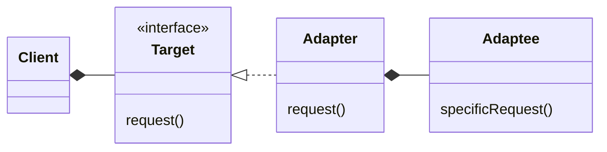

*The Adapter Pattern* converts the interface of a class into another interface the client expects. Adapter lets classes
work together that couldn't otherwise because of incompatible interfaces.

```mermaid
classDiagram
    direction LR
    class Client

    class Target {
        <<interface>>
        request()
    }
    
    class Adapter {
        request()
    }

    class Adaptee {
        specificRequest()
    }

    Client *-- Target
    Target <|.. Adapter
    Adapter *-- Adaptee
```
