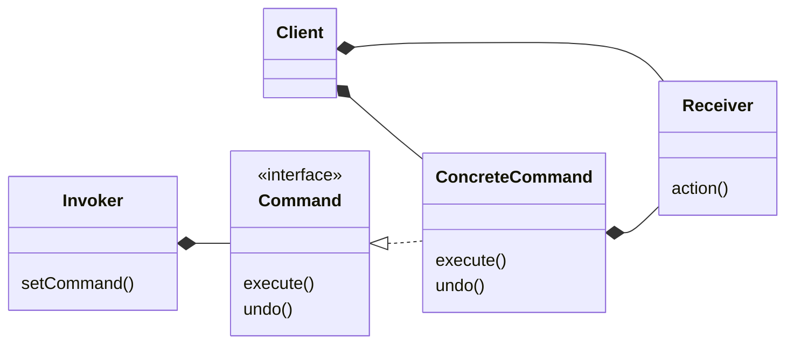

*The Command Pattern* encapsulates a request as an object, thereby letting you parameterize other objects with different
requests, queue or log requests, and support undoable operations.

```mermaid
classDiagram
    direction LR
    class Client

    class Invoker {
        setCommand()
    }

    class Receiver {
        action()
    }

    class Command {
        <<interface>>
        execute()
        undo()
    }

    class ConcreteCommand {
        execute()
        undo()
    }

    Client *-- Receiver
    Client *-- ConcreteCommand

    Invoker *-- Command

    Command <|.. ConcreteCommand
    ConcreteCommand *-- Receiver
```
