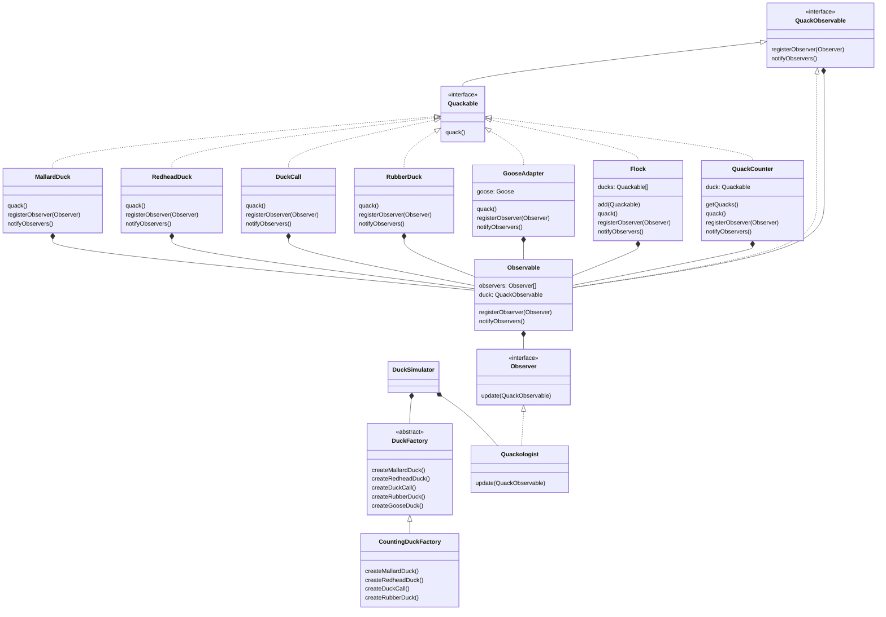

Patterns are often used together and combined within the same design solution.
A compound pattern combines two or more patterns into a solution that solves a recurring or general problem.

```mermaid
classDiagram
    class DuckSimulator

    class DuckFactory {
        <<abstract>>
        createMallardDuck()
        createRedheadDuck()
        createDuckCall()
        createRubberDuck()
        createGooseDuck()
    }

    class CountingDuckFactory {
        createMallardDuck()
        createRedheadDuck()
        createDuckCall()
        createRubberDuck()
    }

    DuckFactory <|-- CountingDuckFactory
    DuckSimulator *-- DuckFactory

    class MallardDuck {
        quack()
        registerObserver(Observer)
        notifyObservers()
    }

    class RedheadDuck {
        quack()
        registerObserver(Observer)
        notifyObservers()
    }

    class DuckCall {
        quack()
        registerObserver(Observer)
        notifyObservers()
    }

    class RubberDuck {
        quack()
        registerObserver(Observer)
        notifyObservers()
    }

    class Quackable {
        <<interface>>
        quack()
    }

    class GooseAdapter {
        goose: Goose
        quack()
        registerObserver(Observer)
        notifyObservers()
    }

    class Flock {
        ducks: Quackable[]
        add(Quackable)
        quack()
        registerObserver(Observer)
        notifyObservers()
    }

    class QuackCounter {
        duck: Quackable
        getQuacks()
        quack()
        registerObserver(Observer)
        notifyObservers()
    }

    Quackable <|.. MallardDuck
    Quackable <|.. RedheadDuck
    Quackable <|.. DuckCall
    Quackable <|.. RubberDuck
    Quackable <|.. GooseAdapter
    Quackable <|.. Flock
    Quackable <|.. QuackCounter

    class QuackObservable {
        <<interface>>
        registerObserver(Observer)
        notifyObservers()
    }

    QuackObservable <|-- Quackable

    class Observable {
        observers: Observer[]
        duck: QuackObservable
        registerObserver(Observer)
        notifyObservers()
    }

    QuackObservable <|.. Observable
    QuackObservable *-- Observable
    MallardDuck *-- Observable
    RedheadDuck *-- Observable
    DuckCall *-- Observable
    RubberDuck *-- Observable
    GooseAdapter *-- Observable
    Flock *-- Observable
    QuackCounter *-- Observable

    class Observer {
        <<interface>>
        update(QuackObservable)
    }

    class Quackologist {
        update(QuackObservable)
    }

    Observer <|.. Quackologist
    Observable *-- Observer
    DuckSimulator *-- Quackologist
```
