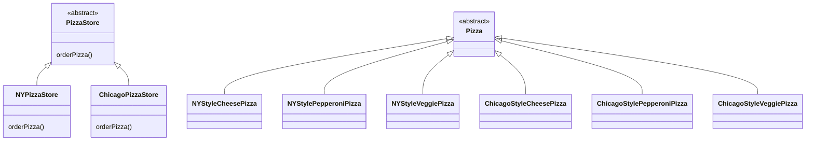
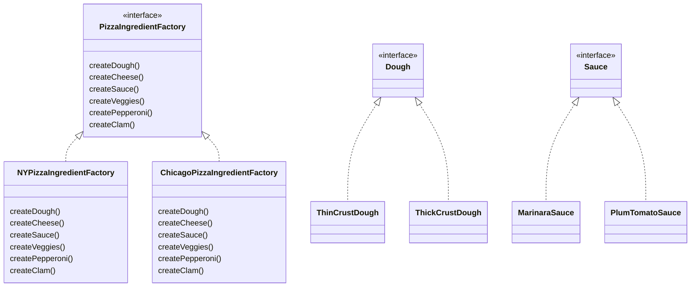

*The Factory Method Pattern* defines an interface for creating an object, but lets subclasses decide which class to
instantiate. Factory Method lets a class defer instantiation to subclasses.

*The Abstract Factory Pattern* provides an interface for creating families of related or dependent objects without
specifying their concrete classes.

