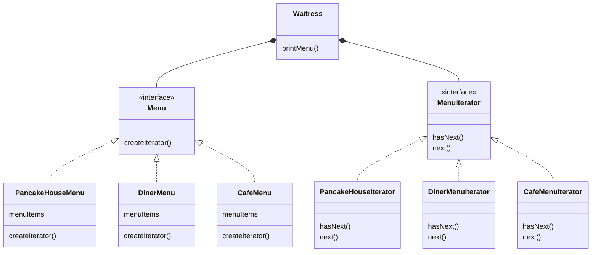

*The Iterator Pattern* provides a way to access elements of an aggregate object sequantially without exposing its
underlying representation.

```mermaid
classDiagram
    class Menu {
        <<interface>>
        createIterator()
    }

    class PancakeHouseMenu {
        menuItems
        createIterator()
    }

    class DinerMenu {
        menuItems
        createIterator()
    }

    class CafeMenu {
        menuItems
        createIterator()
    }

    Menu <|.. PancakeHouseMenu
    Menu <|.. DinerMenu
    Menu <|.. CafeMenu

    class MenuIterator {
        <<interface>>
        hasNext()
        next()
    }

    class PancakeHouseIterator {
        hasNext()
        next()
    }

    class DinerMenuIterator {
        hasNext()
        next()
    }

    class CafeMenuIterator {
        hasNext()
        next()
    }

    MenuIterator <|.. PancakeHouseIterator
    MenuIterator <|.. DinerMenuIterator
    MenuIterator <|.. CafeMenuIterator

    class Waitress {
        printMenu()
    }

    Waitress *-- Menu
    Waitress *-- MenuIterator
```
