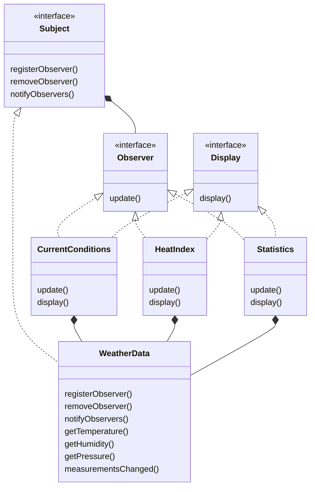

*The Observer Pattern* defines as one-to-many dependency between objects so that when one object changes state, all of
its dependents are notified and updated automatically.

```mermaid
classDiagram
    class Subject {
        <<interface>>
        registerObserver()
        removeObserver()
        notifyObservers()
    }

    class WeatherData {
        registerObserver()
        removeObserver()
        notifyObservers()

        getTemperature()
        getHumidity()
        getPressure()
        measurementsChanged()
    }

    Subject <|.. WeatherData

    class Observer {
        <<interface>>
        update()
    }

    Subject *-- Observer

    class Display {
        <<interface>>
        display()
    }

    class CurrentConditions {
        update()
        display()
    }

    class HeatIndex {
        update()
        display()
    }

    class Statistics {
        update()
        display()
    }

    Observer <|.. CurrentConditions
    Observer <|.. HeatIndex
    Observer <|.. Statistics

    Display <|.. CurrentConditions
    Display <|.. HeatIndex
    Display <|.. Statistics

    CurrentConditions *-- WeatherData
    HeatIndex *-- WeatherData
    Statistics *-- WeatherData
```
