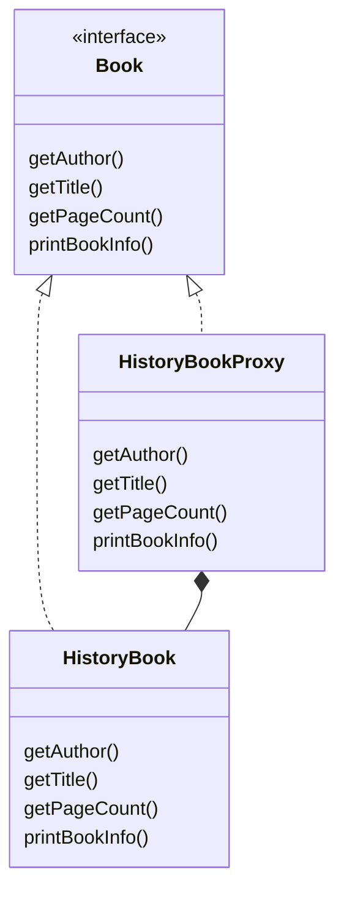

*The Proxy Pattern* provides a surrogate or placeholder for another object to control access to it.

```mermaid
classDiagram
    class Book {
        <<interface>>
        getAuthor()
        getTitle()
        getPageCount()
        printBookInfo()
    }

    class HistoryBookProxy {
        getAuthor()
        getTitle()
        getPageCount()
        printBookInfo()
    }

    class HistoryBook {
        getAuthor()
        getTitle()
        getPageCount()
        printBookInfo()
    }

    Book <|.. HistoryBookProxy
    Book <|.. HistoryBook

    HistoryBookProxy *-- HistoryBook
```
