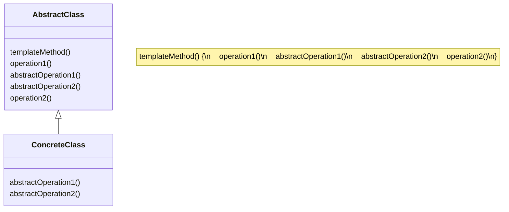

*The Template Method Pattern* defines the skeleton of an algorithm in a method, deferring some steps to subclasses.
Template Method lets subclasses redefine certain steps of an algorithm without changing the algorithm's structure.

